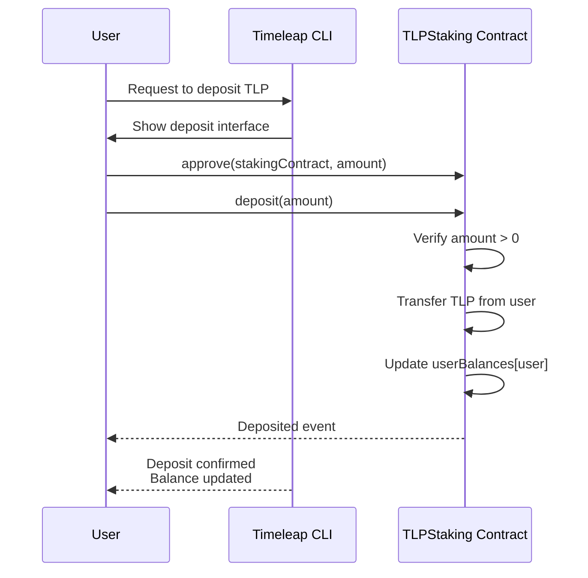
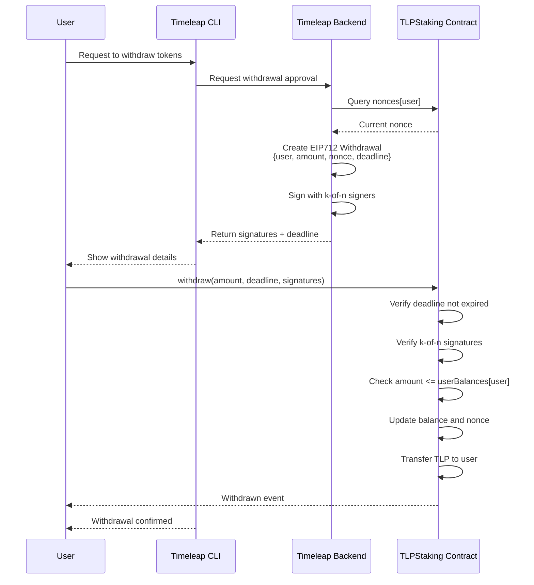
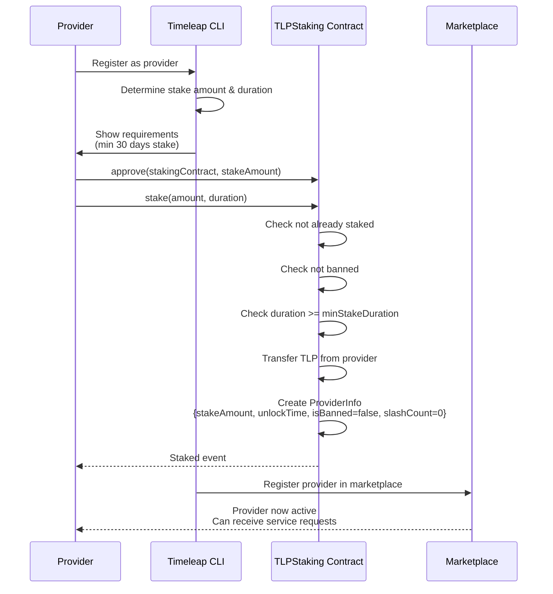
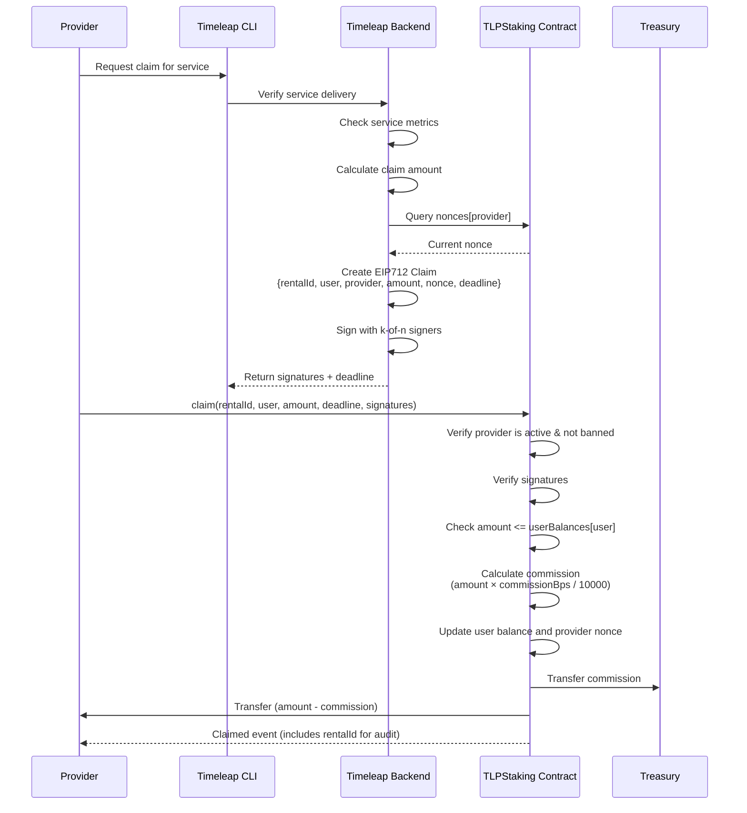
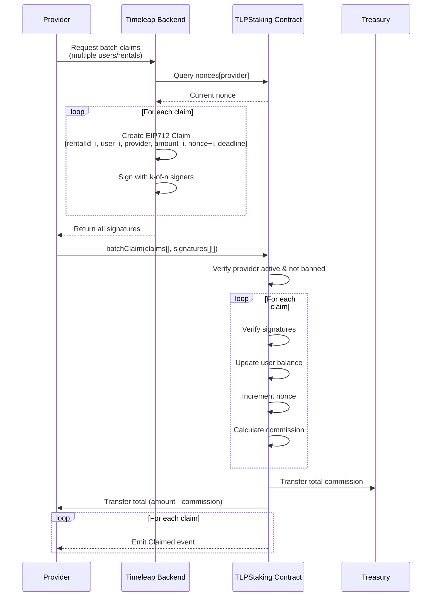
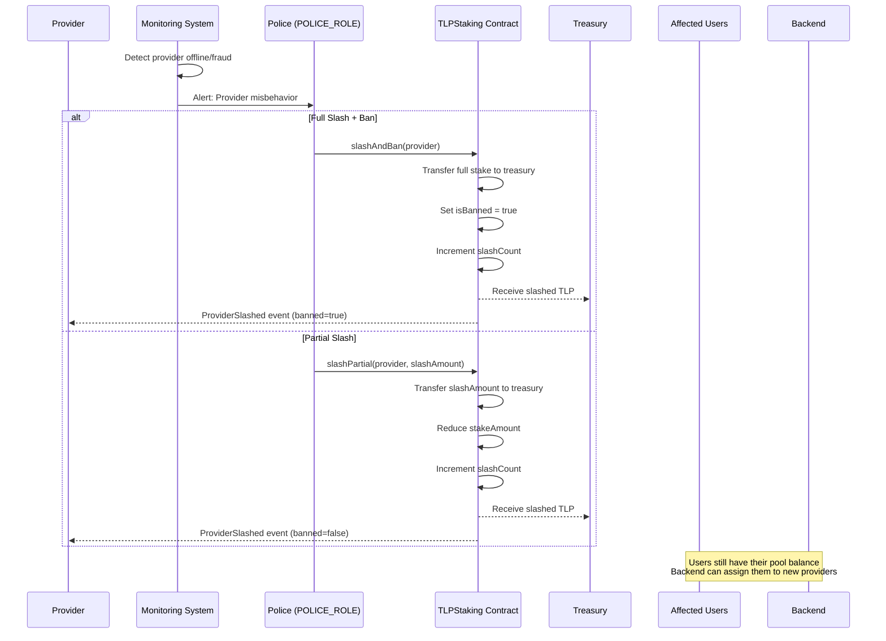
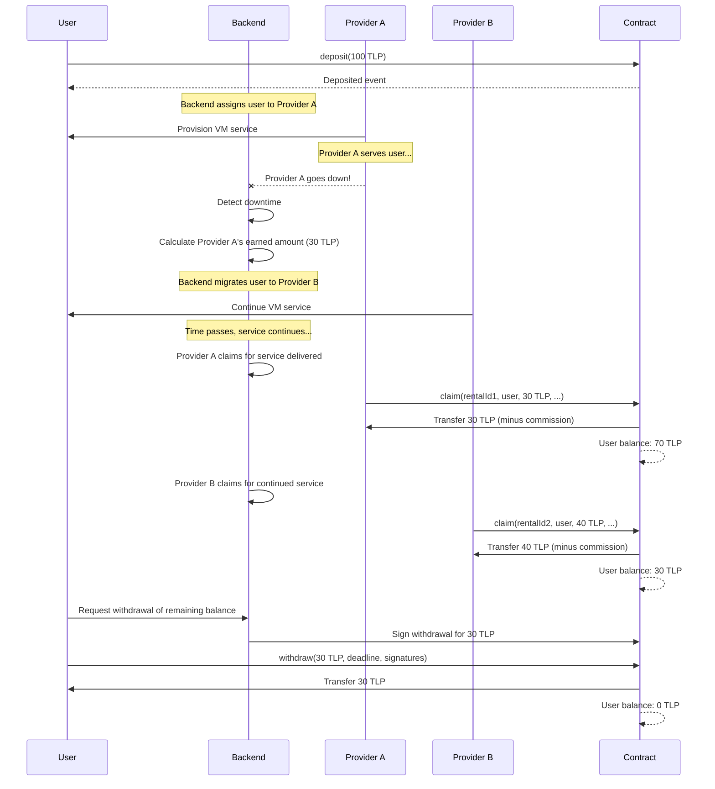
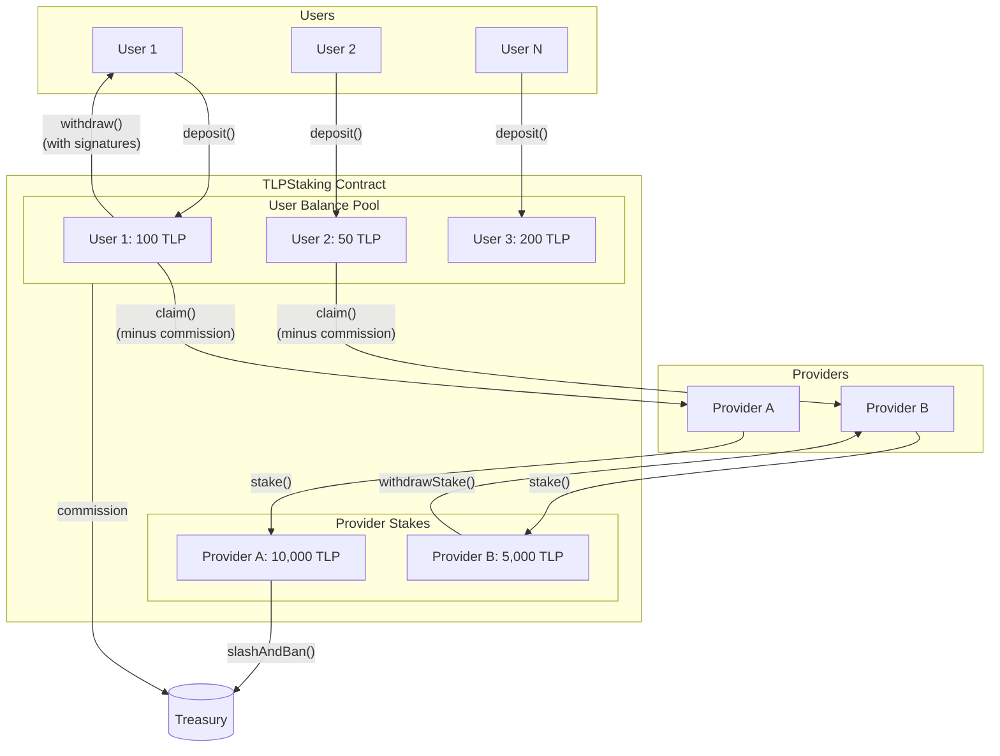

# TLPStaking Interaction Flowcharts

This document contains Mermaid flowcharts illustrating the various user, provider, and system interactions with the TLPStaking smart contracts.

## 1. User Deposits to Pool

Users deposit TLP tokens into the pool without requiring any signatures.



## 2. User Withdraws from Pool

Users withdraw their balance with backend-signed approval.



## 3. Provider Registration (Staking)

How a provider stakes TLP to become active in the marketplace.



## 4. Provider Claims Earnings

Provider claims from a user's balance after delivering service. A commission is deducted and sent to the treasury.



## 5. Provider Batch Claims

Provider claims from multiple users in a single transaction for gas efficiency.



## 6. Provider Misbehavior & Slashing

Police enforcement when a provider fails to deliver or commits fraud.



## 7. Provider Stake Management

Options for providers to manage their stake over time.

```mermaid
flowchart TD
    subgraph extend["Extend Stake Duration"]
        E1[Provider wants to accept longer rentals]
        E2[Call extendStakeDuration]
        E3{newUnlockTime > current<br/>AND >= now + minDuration?}
        E4[Update unlockTime]
        E5[StakeExtended event]
        E6[Reject: Invalid duration]

        E1 --> E2 --> E3
        E3 -->|Yes| E4 --> E5
        E3 -->|No| E6
    end

    subgraph increase["Increase Stake Amount"]
        I1[Provider wants more capacity/trust]
        I2[Approve additional TLP]
        I3[Call increaseStake]
        I4[Transfer TLP to contract]
        I5{Current unlockTime < now + minDuration?}
        I6[Extend unlockTime to now + minDuration]
        I7[Keep existing unlockTime]
        I8[StakeIncreased event]

        I1 --> I2 --> I3 --> I4 --> I5
        I5 -->|Yes| I6 --> I8
        I5 -->|No| I7 --> I8
    end

    subgraph withdraw["Withdraw Stake"]
        W1[Provider wants to exit]
        W2{block.timestamp >= unlockTime?}
        W3[Call withdrawStake]
        W4[Transfer all TLP back]
        W5[Remove from providers]
        W6[StakeWithdrawn event]
        W7[Wait until unlock time]

        W1 --> W2
        W2 -->|Yes| W3 --> W4 --> W5 --> W6
        W2 -->|No| W7
    end
```



## 8. Provider Migration Scenario

How the system handles seamless provider migration when a provider goes down.



## 9. EIP712 Signature Flow

How signatures are created by the backend and verified on-chain.

```mermaid
flowchart LR
    subgraph domain["Domain Separator"]
        D1["name: TLPStaking"]
        D2["version: 1"]
        D3["chainId: network"]
        D4["verifyingContract: address"]
    end

    subgraph types["Message Types"]
        T1["Withdrawal<br/>(user, amount, nonce, deadline)"]
        T2["Claim<br/>(rentalId, user, provider, amount, nonce, deadline)"]
    end

    subgraph signing["Signing Process"]
        S1[Backend creates typed data]
        S2[Hash with domain separator]
        S3[Sign with k signers]
        S4[Return signatures array]
    end

    subgraph verification["On-Chain Verification"]
        V1[Check deadline not expired]
        V2[Recreate digest from params]
        V3[Recover signer from each sig]
        V4[Check signer is authorized]
        V5[Check no duplicate signers]
        V6{k valid signatures?}
        V7[Accept operation]
        V8[Reject operation]
    end

    domain --> S1
    types --> S1
    S1 --> S2 --> S3 --> S4

    S4 --> V1 --> V2 --> V3 --> V4 --> V5 --> V6
    V6 -->|Yes| V7
    V6 -->|No| V8
```



## 10. Token Flow Overview

Visual representation of how TLP tokens move through the system.



## Key Concepts

### Nonce Strategy

| Action     | Nonce Type   | Tracking           | Purpose                               |
| ---------- | ------------ | ------------------ | ------------------------------------- |
| Withdrawal | Per-user     | `nonces[user]`     | Prevent replay of withdrawal requests |
| Claim      | Per-provider | `nonces[provider]` | Prevent replay of claim requests      |

### Signature Deadline

All signatures include a `deadline` parameter:

```
if (block.timestamp > deadline) revert SignatureExpired();
```

This provides time-based protection in addition to nonce-based replay prevention.

### Commission on Claims

When providers claim earnings, a commission is deducted and sent to the treasury:

```
commission = amount × commissionBps / 10000
providerReceives = amount - commission
```

Commission is configured in basis points (e.g., 500 = 5%, 1000 = 10%). Maximum is 10000 (100%).

### Provider Migration

The pool-based architecture enables seamless provider migration:

1. **User deposits once** - tokens stay in the pool
2. **Backend manages assignments** - no on-chain rental state
3. **Multiple providers can claim** - from the same user's balance
4. **No retoken logic needed** - unused balance remains in pool
