# TLPStaking Interaction Flowcharts

This document contains Mermaid flowcharts illustrating the various user, provider, and system interactions with the TLPStaking smart contracts.

## 1. User Rents a VM

Complete flow from user request through CLI, backend signature generation, and on-chain execution.

```mermaid
sequenceDiagram
    participant User
    participant CLI as Timeleap CLI
    participant Backend as Timeleap Backend
    participant Contract as TLPStaking Contract
    participant Provider

    User->>CLI: Request to rent VM (type, duration)
    CLI->>Backend: Find available provider for VM type
    Backend->>Contract: Query providers (stake, unlockTime, isBanned)
    Contract-->>Backend: Provider list with status
    Backend->>Backend: Select best provider<br/>(sufficient stake duration, not banned)
    Backend-->>CLI: Provider match found

    CLI->>Backend: Request rental approval
    Backend->>Backend: Generate unique rentalId
    Backend->>Backend: Get user's current nonce
    Backend->>Backend: Create EIP712 RentalApproval<br/>{rentalId, user, provider, vm, duration, nonce}
    Backend->>Backend: Sign with k-of-n signers (2 of 3)
    Backend-->>CLI: Return signatures + rentalId

    CLI->>User: Show rental cost (vmPricePerSecond × duration)
    User->>Contract: approve(stakingContract, amount)
    User->>Contract: rentFromProvider(rentalId, provider, vm, duration, signatures)

    Contract->>Contract: Verify signatures (k-of-n)
    Contract->>Contract: Check rental doesn't exist
    Contract->>Contract: Check VM price configured
    Contract->>Contract: Check provider active & not banned
    Contract->>Contract: Check provider stake duration covers rental + grace
    Contract->>Contract: Transfer TLP from user
    Contract->>Contract: Create Rental record
    Contract-->>User: RentalCreated event

    CLI->>Backend: Submit tx hash for verification
    Backend->>Contract: Verify transaction success
    Backend-->>CLI: Rental confirmed
    CLI->>Provider: Notify: provision VM for user
    Provider-->>User: VM access credentials
```



## 2. Provider Registration (Staking)

How a provider stakes TLP to become active in the marketplace.


## 3. Provider Withdraws Earnings

Provider claims tokens for delivered services.


## 4. User Claims Refund

User gets tokens back for failed or partial service.


## 5. Provider Misbehavior & Slashing

Police enforcement when a provider fails to deliver or commits fraud.


## 6. Provider Stake Management

Options for providers to manage their stake over time.


## 7. Complete Rental Lifecycle

State machine showing all possible paths a rental can take.


## 8. EIP712 Signature Flow

How signatures are created by the backend and verified on-chain.


## 9. Fund Flow Overview

Visual representation of how TLP tokens move through the system.


## Key Concepts

### Nonce Strategy

| Action | Nonce Type | Tracking | Purpose |
|--------|-----------|----------|---------|
| Rental | Per-user | `rentalNonces[user]` | Prevent replay of same user's rental request |
| Withdrawal | Per-rental | `withdrawalNonces[rentalId]` | Allow multiple partial withdrawals |
| Refund | Per-rental | `refundNonces[rentalId]` | Allow multiple partial refunds |

### Available Balance Calculation

For any rental:
```
available = rental.amount - rental.withdrawnAmount - rental.refundedAmount
```

### Rental Duration Constraint

Before accepting a rental, the contract verifies:
```
block.timestamp + duration + rentalGracePeriod <= provider.unlockTime
```

This ensures the provider's stake remains locked for the entire rental period plus a 7-day grace period.
